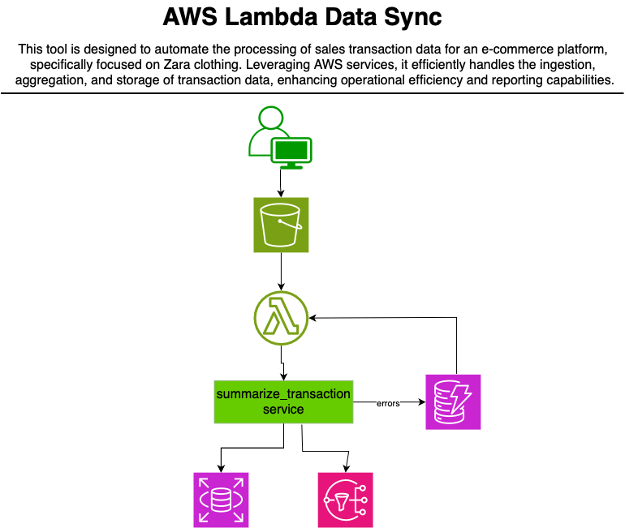

    
    
    
    <h1>AWS Lambda Data Sync + LangChain +FastAPI</h1>

### Project Overview
**aws-lambda-data-sync** is an automated data processing pipeline designed for e-commerce applications. It triggers whenever new transaction data is uploaded to a designated S3 bucket, enabling real-time data aggregation and reporting. This project leverages AWS services such as Lambda, DynamoDB, RDS, and SNS to efficiently manage data aggregation, logging, error handling, and client notifications in a fully automated workflow.

### Key Features
- **Data Aggregation**: Automatically aggregates transaction data from uploaded files in S3.
- **Database Integration**: Posts aggregated data to an RDS database for easy access and reporting.
- **Error Handling**: Logs errors, notifies users, and reprocesses failed data uploads to ensure data integrity.
- **Notifications**: Sends client notifications about processing updates and errors via SNS.
- **Logging**: Records processing information and error details in DynamoDB for auditing purposes.

### Real-World Scenario: Marketplace Seller Transactions & Inventory Updates

#### Problem
Amazon’s marketplace allows third-party sellers to list their products alongside Amazon’s own inventory. These sellers often provide their own data feeds (in CSV or other formats) to update their product listings, sales, pricing, inventory levels, or transaction records. Manual data entry or outdated synchronization processes can lead to inaccuracies in inventory availability, incorrect pricing, and delays in fulfilling customer orders.

To maintain real-time accuracy, Amazon needs to efficiently process these data feeds from thousands of sellers, aggregate transaction data, and keep inventory levels synchronized across its entire system.

---

## Project Architecture
1. **S3 Bucket**: The `reprocess` bucket receives transaction data uploads, triggering the Lambda function.
2. **AWS Lambda**: Processes and aggregates transaction data; updates RDS, logs in DynamoDB, and sends notifications via SNS.
3. **RDS Database**: Stores the aggregated transaction data for analysis and reporting.
4. **DynamoDB**: Logs processing information and error details for transparency and troubleshooting.
5. **SNS**: Sends notifications to clients regarding processing updates and error alerts.

## Getting Started

### Prerequisites
- **AWS Account**: Ensure you have permissions for S3, Lambda, DynamoDB, RDS, and SNS.
- **IAM Role**: Create an IAM role with permissions to access S3, DynamoDB, SNS, and RDS. Attach this role to the Lambda function.
- **Database**: Set up a MySQL database on [db4free.net](https://www.db4free.net/).
  
### Setup Steps

1. **Create IAM Role for Lambda**:
   - Manually create an IAM role with necessary permissions for S3, DynamoDB, SNS, and RDS.
   - Attach this role to the Lambda function.

2. **Configure the Database**:
   - Set up the database on db4free.net and create the necessary tables using the `create_table_get_records_to_test` script.
   - Set the `CREATE_TABLE` flag to `True` in the script to initialize the tables.

3. **Create S3 Bucket**:
   - Create an S3 bucket (e.g., `reprocess-bucket`) and upload the CloudFormation template, Lambda layer, and Python code files.
   - Ensure that bucket permissions allow Lambda to read and write data.

4. **Deploy Resources using CloudFormation**:
   - Deploy the CloudFormation stack to create the resources defined in your templates.

5. **Subscribe to SNS Notifications**:
   - Subscribe clients to the SNS topic created by CloudFormation for notifications.

6. **Add S3 Trigger for Lambda**:
   - Manually add an S3 trigger to invoke the Lambda function on data upload events in the `reprocess` bucket.

7. **Run Tests**:
   - Upload sample transaction data to the S3 bucket to trigger the workflow and validate that the data is processed as expected.

8. **Validate Data in RDS**:
   - Use the `create_table_get_records_to_test` script with the `CREATE_TABLE` flag set to `False` to retrieve and validate records in the database.

---

## CloudFormation Template Structure

CloudFormation templates define resources such as:
- **S3 Bucket** for data storage.
- **Lambda Function** for data processing.
- **SNS Topic** for client notifications.
- **DynamoDB Table** for logging.
- **RDS Instance** for persistent storage.

Ensure all templates are organized and uploaded to the S3 bucket before deployment.

---

## API Endpoints

The following API endpoints are available for interacting with the e-commerce data processing system:

### 1. Upload Transaction File
- **Endpoint**: `POST /api/transactions/upload`
- **Description**: Allows clients to upload transaction files to the S3 bucket for processing.
- **Request**: Expects a file upload in the request body.
- **Response**: Returns a success message if the upload is successful.

### 2. Get Aggregated Transaction Data
- **Endpoint**: `GET /api/transactions`
- **Description**: Fetches aggregated transaction data from the RDS database.
- **Response**: Returns a list of aggregated transaction records.

### 3. Get Transaction Summary
- **Endpoint**: `GET /api/transactions/summary`
- **Description**: Provides a summary of transactions based on specified filters (e.g., date range, product category).
- **Query Parameters**: Optional filters can be provided in the request.
- **Response**: Returns a summary of transactions matching the filters.

### 4. Get Error Logs
- **Endpoint**: `GET /api/errors`
- **Description**: Retrieves error logs from DynamoDB to help diagnose processing issues.
- **Response**: Returns a list of error logs with details.

### 5. *POST Natural Language Queries*

- **Endpoint**: POST `/api/queries`
- **Description**: Allows users to query the database using natural language. The system interprets the natural language query and converts it into a structured SQL query to retrieve relevant data.
- **Response**: Returns a JSON object containing the results of the query, including details like product name, quantity, amount, and revenue.
---

## Usage

### Triggering the Workflow
1. **Upload Data**: Place transaction files in the `reprocess` S3 bucket. This action automatically triggers the Lambda function.
2. **Data Processing**: Lambda processes and aggregates the data, then posts it to RDS.
3. **Error Handling**: In case of errors, Lambda logs details to DynamoDB and places the erroneous data into an error bucket for later analysis.
4. **Client Notifications**: Clients are notified via SNS about the status of their uploads and any errors encountered during processing.
