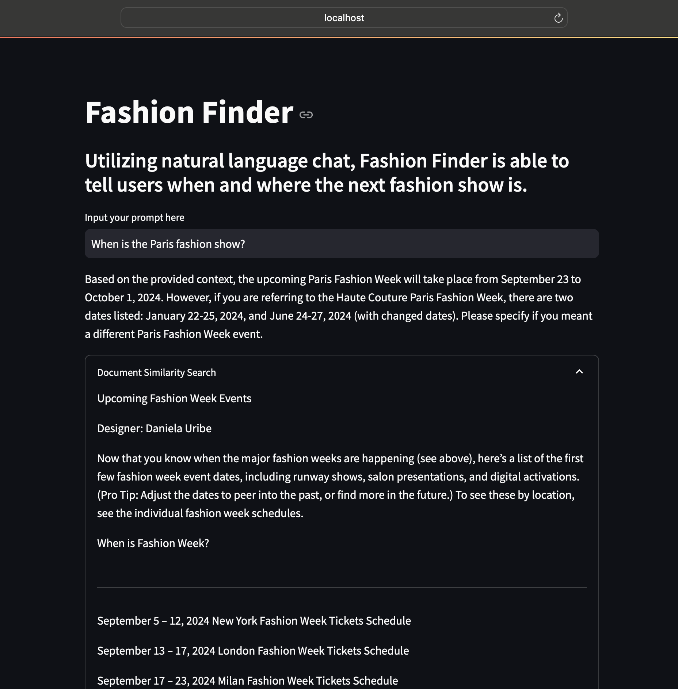

# RAG Model - Fashion Finder

**Fashion Finder** is a Streamlit application that utilizes natural language processing to provide users with timely information about upcoming fashion shows. By leveraging the ChatGroq model and a retrieval-augmented generation (RAG) architecture, Fashion Finder can accurately answer user queries regarding the schedule and location of the next fashion events.
<br/>

## App Screenshot



## Features

- **Natural Language Interaction**: Users can interact with the application using natural language to ask about upcoming fashion shows.
- **Document Retrieval**: The application retrieves relevant documents from a specified URL to provide accurate context-based answers.
- **Text Splitting and Embeddings**: Text from documents is split into manageable chunks, and embeddings are generated for efficient information retrieval.
- **User-Friendly Interface**: A simple and intuitive Streamlit interface allows users to input prompts and view answers effortlessly.
- **Document Similarity Search**: Users can explore related documents based on their queries.

## Installation

To run the Fashion Finder application locally, follow these steps:

1. Clone the repository:

   ```bash
   git clone <your-repo-url>
   cd fashion-finder
   ```

2. Create a virtual environment and activate it:

   ```bash
   python -m venv venv
   source venv/bin/activate  # For Windows use `venv\Scripts\activate`
   ```

3. Install the required packages:

   ```bash
   pip install -r requirements.txt
   ```

4. Set up your environment variables:

   Create a `.env` file in the root directory and add your Groq API key:

   ```plaintext
   GROQ_API_KEY=<your-groq-api-key>
   ```

## Usage

To start the Fashion Finder application, run the following command:

```bash
streamlit run app.py
```

Open your browser and navigate to `http://localhost:8501` to access the application.

## Technologies Used

- **Streamlit**: For building the web application interface.
- **LangChain**: To handle document loading, text splitting, and embedding generation.
- **Ollama**: For generating embeddings.
- **FAISS**: For efficient vector storage and retrieval.

## Contributing

Contributions are welcome! If you have suggestions for improvements or want to report bugs, please open an issue or submit a pull request.

## License

This project is licensed under the MIT License. See the [LICENSE](LICENSE) file for details.

## Acknowledgments

- [Streamlit](https://streamlit.io/)
- [LangChain](https://langchain.readthedocs.io/en/latest/)
- [Ollama](https://ollama.com/)
- [FAISS](https://faiss.ai/)
